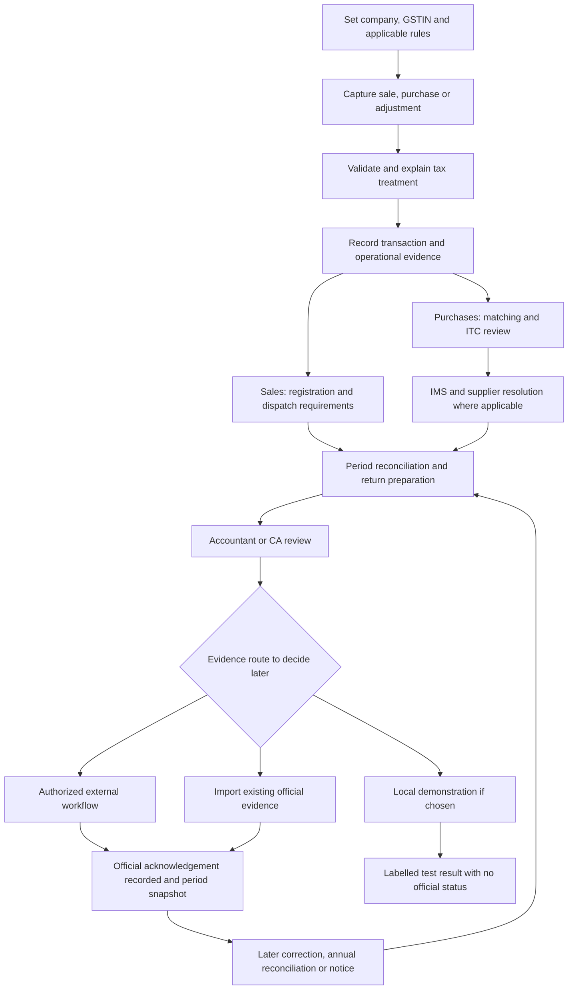

# Webapp product and GST workflow map

Version: discussion draft, 24 September 2026. This updates the first research pass. It defines desired product behaviour, not completed software or implementation architecture.

Current consolidated list: [Marg + Byteception feature map](../consolidated/new-feature-list.md). That version retains this document's 24 GST capability groups and all baseline rows, with explicit collaboration, document and work-management refinements. The detailed GST workflows linked below remain applicable.

**Confirmed direction**

- A new ERP competing with Marg, with stronger GST capabilities and workflows.
- Retain every feature in the researched Marg baseline. No features are removed to create a smaller initial product in this map.
- Discuss the webapp only. Express the work done by mobile/companion applications through appropriate browser workspaces; native applications are outside this discussion.
- Development stays local for now. This does not by itself select production hosting, offline operation, synchronization or a technology stack.
- Support multiple companies, GST registrations and branches. Business staff prepare records; an accountant or external CA reviews them.
- Technology, architecture and delivery priorities remain discussion decisions. No roadmap sequence is assigned here.

The user explicitly deferred the local portal interaction mode until after this feature map. Simulation, file imports and a provider sandbox remain alternatives to discuss. A local installation never creates an official IRN, e-way bill, filing acknowledgement or payment merely by showing a successful test screen.

**How the documents fit together**

| Document | Purpose |
|---|---|
| [Original edition comparison](edition-feature-matrix.csv) | Preserved vendor evidence: 93 source rows, including unusual and specialist capabilities |
| [Webapp parity map](webapp-parity-map.csv) | 156 planning entries: all 93 source rows, 60 additional researched jobs and 3 confirmed organizational/review workflows; overlap is intentional |
| [Parity notes](webapp-parity-notes.md) | Interpretation and evidence limitations |
| [GST capability map](gst-capability-map.csv) | 24 proposed capability groups linked to the detailed workflows; these elaborate and extend the baseline and are not additive independent-feature counts |
| [GST inward workflows](gst-inward-workflows.md) | Purchase evidence, matching, eligibility, IMS, supplier resolution and reversal/reclaim |
| [GST outward workflows](gst-outward-workflows.md) | Tax determination, invoices, dispatch, corrections and return filing |
| [GST special cases](gst-special-cases.md) | Multi-registration operations, RCM, imports/exports, regimes, annual work and disputes |
| [Research evidence](product-research.md) | Vendor and official sources; earlier prioritization/architecture suggestions are superseded as decisions |

The parity register preserves what public evidence establishes. It is not proof that every function in the installed Marg application has been discovered. A subsequent walkthrough must fill undocumented settings and edition-specific behaviour. External commercial networks, third-party data licences and live integrations remain explicit dependencies rather than assumed assets.

**Whole-ERP scope retained**

| Browser workspace | Functional coverage |
|---|---|
| Organisation and administration | Companies, GSTINs, branches, stores, financial years, users, powers, review rights, logs, configuration and document numbering |
| Catalogue and pricing | Items/services, units, packs, variants, salts/substitutes, batches, serials, MRP, price lists, schemes, discounts and historical rates |
| Sales and counter billing | Quotations, orders, challans, retail/wholesale/POS, split tenders, returns inside billing, shortcuts, bill design, printing and customer context |
| Procurement | Indents, quotations, orders, temporary purchase entry, receipts, bills, imports, purchase economics and supplier claims |
| Inventory | Warehouses/racks, transfers, conversions/bundles, consignment, secondary stock, counts, shortages, expiry, replacements, scrap and crate/container tracking |
| Accounts and banking | Journals, ledgers, receivables/payables, credit controls, bill allocation, PDCs, reconciliation, interest, collections, cost centres, budgets and statements |
| Distribution and customer operations | CRM, salesmen/routes, retailer ordering, field billing, dispatch, delivery, owner views, credit requests and order status |
| Manufacturing | Materials, formulations/BOM, production, batch costs and documented quality/manufacturing records |
| Specialist trade workflows | Pharmacy H1/narcotics and prescription records; garment variants; jewellery/repair; mandi bags/expenses; kitchen orders; OPD and other evidenced specialist entries |
| Reports and document output | MIS, comparisons, consolidated views, drilldown, scheduled exports, packing slips, gate passes, labels and configurable reports |
| Connected business services | Banking, payment links, messaging, ecommerce, ERP exchange, supplier/retailer network workflows and authorized channel reports |
| People and continuity | Documented payroll functions, data migration, backups/restores, financial-year carry-forward, imports/exports and audit history |

Browser parity means preserving the useful business operation, not necessarily reproducing an old keyboard key literally. Hardware functions need a later browser/device feasibility check. Network services such as drug directories, banking, maps and supplier ordering require legitimate data or service access; a matching screen alone would not establish parity.

**Shared webapp behaviour**

Every working page shows the selected company, GSTIN, branch/store, financial year, tax period where relevant, data freshness and evidence origin. The system distinguishes a branch using the same GSTIN from a branch holding another registration. A group view can aggregate information but cannot itself authorize a cross-GSTIN credit offset or file a combined return.

Owners see cash exposure and work awaiting attention. Billing operators see invoice/dispatch errors they can fix. Procurement staff see receipt and supplier discrepancies. Accountants see tax treatment and reconciliation evidence. Reviewers see changes since the last review. Authorized signatories see the exact submission they are approving. An external CA's access is limited to the companies/GSTINs assigned to them.

Every exception is a case with affected documents, amount, cause, responsible person, next step, due date, comments, evidence and resolution history. Resolving a UI task does not change accounting or government records unless its explicit workflow performs and records that action.

**GST workspaces and enhanced features**

| ID | Workspace | Features and user outcome |
|---|---|---|
| GST-01 | Registration and applicability | Effective-dated registration/regime, filing frequency, turnover history, authorized signatory, declared locations and obligations. Explain why each return or document requirement applies. |
| GST-02 | Tax masters and policies | HSN/SAC/UQC, taxability, cess and valuation rules, place-of-supply decisions, bill-to/ship-to, exemptions and rate history. Record the basis and reviewer for exceptional classifications. |
| GST-03 | Invoice assistant | Line-level explanation, GSTIN checks with verification date, arithmetic/rounding review, duplicates, party status and tax-inclusive pricing. Preview corrections and preserve original evidence. |
| GST-04 | E-invoice workbench | Applicability, validation, registration, original acknowledgement/QR evidence, errors, cancellation eligibility and uncertain-response recovery. Link all attempts to one document. |
| GST-05 | Transport compliance | E-way applicability, transport/vehicle details, generation, updates, validity/extension checks, consolidation and dispatch readiness. Respect active rules rather than withdrawn announcements. |
| GST-06 | Purchase evidence inbox | PDF/photo/spreadsheet/manual capture, field provenance, party/item mapping, PO/receipt/service evidence, duplicate controls and quantity/rate/tax variances. |
| GST-07 | Reconciliation | Books versus 2B/IMS, sales versus IRP/GSTR-1, amendments, prior periods, credit notes and imported documents. Explain proposed matches and isolate unexplained differences. |
| GST-08 | ITC review | Eligibility at line/amount level; evidence requirements; blocked/common/nonbusiness credit; receipt/payment conditions; claim history; reversals/reclaims; deadline exposure. |
| GST-09 | IMS decisions | Allowed actions per record/period, consequence preview, no-action exposure, pending deadlines, remarks, actual reversal amounts and acknowledgement/recomputation checks. |
| GST-10 | Supplier/customer resolution | Dispute bundles, follow-up drafts, evidence exchange, owner assignment and reminders. Commercial payment decisions remain separate from a GST mismatch. |
| GST-11 | Returns, claims and notes | Original-invoice-linked returns; expiry/breakage/destruction; replacements; discounts; commercial notes versus GST adjustments; tax and stock effects reviewed separately. |
| GST-12 | RCM and adjustments | Classified obligations, self-documentation where applicable, tax liability/payment evidence and separately reviewed ITC. Explain applicability rather than treating every unregistered purchase as RCM. |
| GST-13 | Filing workspace | Period checklist, GSTR-1/IFF/1A and 3B preparation, other applicable forms, variance bridge, approvals, export/upload/signing status, official acknowledgements and locked filed snapshots. |
| GST-14 | Liability and payment view | Estimated versus approved liabilities, credit/cash ledger evidence, allocation, payment references, interest/late-fee review and period-specific obligations. Bank payment is not automatically proof of return filing. |
| GST-15 | Multi-GSTIN operations | Same-registration movement, distinct-person supply and ISD workflows remain separate. Pair sending/receiving records and reconcile interbranch discrepancies without concealing them in group totals. |
| GST-16 | Imports, exports and SEZ | BoE/customs evidence, import credit matching, export/SEZ applicability, LUT/bond evidence where relevant and refund dossier/status. Domestic matching rules cannot be blindly reused. |
| GST-17 | Special taxpayer regimes | Composition, QRMP and relevant TDS/TCS/ISD cases with registration-specific forms, rights and calculations. Keep GST deductions distinct from income-tax deductions. |
| GST-18 | Annual compliance and migration | GSTR-9/9C where applicable, financial-year versus return-period reconciliation, historic claims/reversals, migration control totals and unresolved opening cases. |
| GST-19 | Notices and evidence | Notice intake, response dates, issue-to-transaction links, evidence bundles, response versions and authorized submission/acknowledgement. No fabricated legal response or automatic admission. |
| GST-20 | Compliance change workbench | Source/effective-date/supersession tracking, rate/MRP transition previews, impact assessment, reviewer sign-off and period-specific audit evidence. |
| GST-21 | Common credit and capital goods | Attribute exclusive/common use, document allocation bases, prepare periodic reversal and applicable annual adjustment, track capital-goods history and preserve reviewer-approved calculations. |
| GST-22 | Job work | Principal/job-worker roles, challans, goods sent and partially returned, direct dispatch, scrap/waste, applicable statutory clocks and reporting, and overdue-case assessment. |
| GST-23 | Advances and adjustments | Receipt/payment evidence, receipt/refund vouchers where applicable, goods/services tax assessment, allocation to invoices, cancellation/refund, unadjusted balances and period reporting. |
| GST-24 | CA engagement and review | Explicit client/company/GSTIN access, assigned preparations, versioned review packs, reviewer reassignment, approval independence policy, client handover and access revocation. |

These are capabilities to specify and validate, not blanket claims of missing Marg functionality. The design goal is better execution and explanations across the complete transaction lifecycle.

**How this appears in the webapp**

The 24 capability areas are not 24 top-level menu items. Keep sales, purchases, inventory and accounts as the everyday workspaces, with tax explanations directly inside their document screens. A dedicated GST hub can group specialist work into seven destinations:

| Navigation destination | Typical pages and actions |
|---|---|
| Overview and tasks | Scope/period selector, upcoming obligations, evidence freshness, client engagements, review requests, exposure breakdown and assigned exception queue |
| Tax documents and dispatch | Outward register, document detail, validation, e-invoice attempts, e-way/transport details and linked adjustments |
| Purchases, matching and ITC | Evidence inbox, side-by-side matching, eligibility/common-credit allocations, capital-goods history, claim/reversal/reclaim register, supplier cases and IMS action review |
| Returns and payments | GSTIN/period checklist, form working, book-to-return bridge, review diff, filing evidence and ledger/payment reconciliation |
| Special transactions | RCM, branch supplies, ISD, job work, advances, BoE/imports, exports/SEZ/refunds and applicable composition/QRMP/TDS/TCS work |
| Annual work and notices | Annual bridges, historic-period explanations, evidence bundles, notices and response versions |
| Tax setup and history | Applicability, classifications, effective rules, rate-transition previews, access/review policy and auditable decisions |

A transaction detail page has a persistent identity and summary; original source beside entered values; an activity/history view; linked stock/payment/tax documents; open issues; and permitted next actions. Comparison pages show differences by field and tax head. Bulk-action previews list what will change, excluded records and per-row failures; an overall success banner must never conceal partial failure.

An owner overview should show non-overlapping amounts with a drilldown and explanation. For example, credit awaiting supplier evidence and credit awaiting reviewer action can overlap; do not add them into a purported total recoverable amount. Due dates show their legal period/source and applicable extension when verified; reminders are user tasks, not a substitute for determining the correct deadline.

**The linked workflow**

The diagram links business workflows; it is not a software architecture.

**Independent states prevent misleading results**

One invoice cannot be represented accurately by one status such as “done.” The interface needs separately visible dimensions:

| Dimension | Example states |
|---|---|
| Business document | Draft, reviewed, posted, corrected by linked document, reversed |
| Goods/services evidence | Not received, partly received, received, evidence disputed, returned |
| Commercial settlement | Unpaid, partly paid, paid, credit-adjusted, disputed |
| Portal evidence | Not acquired, current import, stale import, acknowledgement received, status uncertain |
| Matching | Unmatched, exact, proposed, partial/aggregate candidate, mismatch, duplicate suspicion |
| ITC decision | Review required, eligible amount determined, blocked amount, claim/reversal/reclaim entries recorded |
| IMS | No action, proposed action, approved action, submitted/recorded action, acknowledged status, recomputation required |
| Filing | Locally preparing/exported, review requested, changes required, approved version, externally submitted evidence recorded, official filing acknowledgement recorded |

All states are qualified by amount, period and scope. One partially paid invoice can simultaneously contain eligible and blocked amounts. An accepted IMS record can still need an eligibility review. GSTN explicitly says 2B does not decide every eligibility condition. [GSTN 2B FAQ](https://tutorial.gst.gov.in/userguide/returns/FAQ_gstr2b.htm)

Actions that change underlying transactions, tax rules, portal evidence or decisions after review produce an understandable change list and invalidate affected approvals. The original reviewed/filed version stays available. A later portal import must not silently replace the evidence supporting an earlier filing.

**Review policy and external CA handoff**

Recommended behaviour for discussion: routine transactions that pass approved policy can be completed by authorized operators; requiring a CA to approve every ordinary counter bill would interrupt operations. Configured business approvals, unusual tax decisions, overrides, credit allocations and period filing have their own review requirements. The final policy, including any small-team self-review exception, remains to be agreed.

For an external CA, the business owner grants an engagement limited to named companies/GSTINs and permitted tasks. Staff submit a dated version of a period pack; the reviewer sees its differences, records questions and requests corrections. Reassigning a reviewer does not transfer an unexamined approval. A change in scope or access cannot expose another client's records. Client removal revokes future access and outstanding access links while preserving past decisions in the business's audit history; handover/export is an explicitly authorized workflow.

Acceptance: a CA assigned only Company A cannot search or export Company B; an assistant cannot approve outside assigned powers; a revised pack invalidates only affected approvals with an explanation; a revoked reviewer cannot open a retained link; a handover retains who originally approved each version.

**Examples the product must handle well**

1. **Missing supplier invoice:** the purchase exists in Company A's books but not in the applicable portal evidence. Show amount and period, check timing/amendments, assign a supplier case and preserve eligibility review. Do not delete the purchase or invent a portal match.
2. **Credit note after earlier reversal:** show the original claim and reversal history, the new note, the relevant allowed IMS action and the incremental amount still requiring adjustment. Prevent duplicate reversal.
3. **Customer return after a rate change:** identify original invoice/batch, return quantity, chosen legal adjustment path and corresponding tax basis. Do not apply today's master rate merely because the item code matches.
4. **Same invoice number, different supplier or GSTIN:** retain both valid documents; detect duplicates using context. Preserve original document numbers even when search/matching uses normalization.
5. **Late goods receipt or partial receipt:** retain receipt evidence separately from portal matching and ask for the applicable eligibility assessment. Do not automatically prorate or claim tax merely from a stock count.
6. **Two branches with different GSTINs:** prepare the appropriate dispatch/supply and receipt records, reconcile both ends and report differences. A same-GSTIN stock transfer follows a different route.
7. **Review becomes stale:** a preparer corrects a purchase after CA review. Show the resulting ITC and return differences and request review of the changed version rather than keeping a misleading green approval.
8. **Response lost after submission:** show uncertain status and recover evidence before retrying. In local development, simulate this failure explicitly without making the record look officially filed.
9. **Imported evidence belongs to another company:** quarantine it with a clear explanation; never merge it into the selected GSTIN merely because its totals look plausible.
10. **One problem appears in several dashboards:** identify overlapping cases so a supplier mismatch and pending ITC review do not double-count the same financial exposure.

The detailed workflow documents add legal conditions, alternative branches, roles and acceptance cases. These examples describe product behaviour and do not prescribe a taxpayer's legal conclusion without the relevant facts.

**Local-development options for later discussion**

If fixtures are chosen, they should cover multiple companies and registrations, regular/composition cases, partial receipts/payments, mismatches, credit notes, rate changes, RCM and failed submissions. Source documents and imported portal files are another useful demonstration option. Every simulated record must be conspicuously labelled and must not produce an unqualified “Filed,” “Paid,” “IRN generated,” or “GSTIN verified” claim. None of these modes has yet been selected.

For a real portal file, show filename, taxpayer/period, import time and whether evidence is stale. A file demonstrating a past filing can be recorded as imported filing evidence; importing it does not mean this app performed that filing. Keep demonstration data isolated from any later real business records.

No production hosting, paid provider, native app, database, framework or deployment plan is selected by this specification.

**Discussion questions to settle after reviewing the map**

1. Local workflow mode: simulation plus file imports, an available provider sandbox, or defer this choice?
2. Business examples: which real business can provide anonymized transactions for validation while all documented features remain in the product map?
3. Review authority: can an accountant both prepare and approve when staffing requires it, with an explicit exception trail, or must another reviewer always approve?
4. First complete demonstration journey: sale-to-filing, purchase-to-ITC, or the full monthly close? This sequences demonstration work; it does not remove other features.
5. Browser operation: must users continue billing during loss of internet, and does local mean one development machine or eventual office-LAN access? This determines a later architecture conversation.
6. Team constraints: any preferred stack, existing code or developer familiarity to respect when that discussion begins?

Recommended answers to discuss: labelled simulation/imports; real anonymized examples from an accessible business; distinct reviewer by default with a recorded owner-authorized exception policy; a monthly-close walkthrough containing both sales and purchases. Browser connectivity and stack choices remain open until the user's operating conditions are known.
