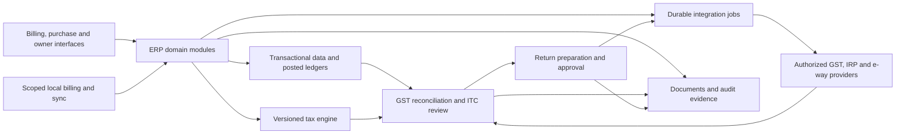

# Marg product research and a proposed competing ERP

Research date: 24 September 2026. Direction confirmed by the user: build a new ERP competing with Marg.

Scope update: the user subsequently confirmed a webapp, local development, retention of all documented Marg features, multiple companies/GSTINs/branches, and business staff preparing records for accountant/CA review. The current consolidated product list is [Marg + Byteception feature map](../consolidated/new-feature-list.md); the detailed [GST workflow map](product-and-gst-workflow-map.md) remains supporting material. The initial segment, release-priority and architecture suggestions below remain historical discussion options; they are not adopted decisions.

This is a public-documentation assessment conducted by four research agents plus the lead agent. Sources include vendor product pages, edition comparisons, API documentation, support procedures and official GST material. It is not a hands-on assessment of a licensed installation. Public pages can describe different releases, editions and paid services. “Documented” below means a vendor describes a workflow; it does not mean we executed it. A feature not found in public documentation is unknown, not proven absent.

**Product assessment**

Marg is a trade ERP with substantial inventory and distribution depth. Its appeal comes from connecting sales, purchase, stock, collections and accounting with industry-specific routines. A competitor needs to support the working day of a distributor or retailer before its GST improvements become useful. The main product targets Indian SMEs, especially pharma and FMCG. [Vendor overview](https://margcompusoft.com/)

My proposed starting point is a complete ERP for regular-GST-registered FMCG wholesalers/distributors, initially with one GSTIN and a small warehouse operation. This is a product hypothesis, not validated market demand. It provides meaningful purchase reconciliation, schemes, returns, credit and dispatch problems without requiring the entire pharmaceutical workflow at launch. If our strongest customer access is to pharma distributors, choose that vertical instead and include its batch, expiry and claims requirements from day one.

**Core feature inventory**

The separate edition-feature-matrix.csv preserves the public Basic/Silver/Gold comparison. It is a vendor feature list, not a commercial entitlement guarantee. The inventory below explains the principal functional areas and their purpose.

| Area | Important capabilities found | Evidence and boundary |
|---|---|---|
| Sales and billing | Retail/wholesale invoices, quotations, sales orders, delivery challans, returns, debit/credit adjustments, configurable invoice formats, barcode billing, party/item pricing and schemes | [Detailed features](https://margcompusoft.com/key_features.html); confirm plan and trade setup |
| Counter operations | Touchscreen POS, cash drawers, weighing-scale integration, multiple counters, loyalty, discounts, local-language printing and home delivery | [Supermarket product](https://margcompusoft.com/retail/supermarket_software.html); device compatibility needs testing |
| Product and stock records | Item masters, barcodes, batches, expiry, MRP/rates, unit conversion, warehouse/rack stock, low-stock and near-expiry visibility | [Pharmacy product](https://margcompusoft.com/retail/pharmacy_software.html) and [API master fields](https://margcompusoft.com/api/MobileSolutions.html) |
| Replenishment | Reorder points, shortage analysis, purchase planning, supplier comparison and slow-stock promotion | [FMCG product](https://margcompusoft.com/distribution/fmcg_software_india.html) |
| Purchasing | Purchase orders/invoices, purchase returns, supplier records and invoice import; party/item mapping is part of operational setup | [Import/export documentation](https://care.margcompusoft.com/margerp/data-import-export/169862/1/common) |
| Purchase capture | PDF purchase import through Digital Entry and Wallet; user selects party/bill details, generates and saves the resulting bill | [PDF workflow](https://care.margcompusoft.com/margerp/digital-entryy/183040/1/how-to-import-purchase-pdf-file-through-wallet-of-marg-software); asynchronous processing is documented |
| Photo capture | Marg Genie advertises photographing paper invoices and importing them into ERP | [Genie](https://margcompusoft.com/marg-genie/index.html); accuracy and exception handling were not tested |
| Distribution | Customer credit limits, salesman/route operations, orders, packing/dispatch/delivery, supplier and customer claims | [FMCG distribution](https://margcompusoft.com/distribution/fmcg_software_india.html) |
| Returns and adjustments | Sale/purchase returns, breakage/expiry receive/issue, replacements, scrap, price differences, stock issue/receipt | [Support module index](https://care.margcompusoft.com/margerp/changes-history); not all transaction types have identical tax treatment |
| Accounting | Ledgers, vouchers, cash/bank books, receivables/payables, trial balance, profit/loss and balance sheet | [Accounting product](https://margcompusoft.com/accounting-software.html) |
| Collections and treasury | Bill tagging, outstanding balances, PDCs, dishonoured cheques, bank reconciliation and connected banking | [Support module index](https://care.margcompusoft.com/margerp/changes-history); supported bank statement formats differ from live banking integrations |
| Management accounting | Cost centres, budgets, targets, claim/incentive and collection analysis | [Support module index](https://care.margcompusoft.com/margerp/changes-history); edition restrictions apply |
| Reporting | Stock/sales, financial, customer/supplier, route/salesman and tax reports, configurable formats and common export formats | [Feature detail](https://margcompusoft.com/key_features.html) and [vendor FAQ](https://margcompusoft.com/faq.html) |
| Controls | Operator rights, approvals, freeze controls, login records, audit functionality and backup/restore workflows | [Support module index](https://care.margcompusoft.com/margerp/changes-history); tamper resistance and retention need hands-on verification |
| Multi-company/location | Companies, warehouses, branches, consolidated visibility and inter-location workflows | [Edition comparison](https://margcompusoft.com/marg-features.html); do not equate warehouse, branch, legal company and GST registration |
| Data portability | Item/ledger imports, purchase imports, ERP Bridger, account/inventory exchange and Tally-related transfers | [Import/export procedures](https://care.margcompusoft.com/margerp/data-import-export/169862/1/common); sample exports must be checked for completeness |

**Industry depth**

| Audience | Additional workflows to understand | Implication for our product |
|---|---|---|
| Retail chemists | Medicine/salt lookup, alternatives, prescriptions, patient/refill reminders, promise orders, batch expiry and supplier returns | Pharmacy is a specific product, not a generic POS with a medicine catalogue. [Chemist](https://margcompusoft.com/retail/chemist_software.html) |
| Pharma distributors and C&Fs | Chemist ordering, batch stock, expiry claims, purchase import, field collections and manufacturer reporting | High-value candidate, but correct returns/claims handling and migration are essential. [Pharma distribution](https://margcompusoft.com/distribution/pharma_software.html) |
| FMCG distributors | Schemes, credit, routes, salesmen, dispatch, claim tracking and slow/near-expiry stock | Recommended initial scope, subject to customer access. [FMCG distribution](https://margcompusoft.com/distribution/fmcg_software_india.html) |
| Kirana/supermarket | Rapid barcode/MRP billing, scales, loyalty, schemes, cash control and replenishment | Counter speed, device support and interruption recovery matter alongside GST. [Supermarket](https://margcompusoft.com/retail/supermarket_software.html) |
| Garments | Size/colour/style/brand/season variants, labels, exchanges and commissions | Requires a different item/variant model. [Garments](https://margcompusoft.com/retail/garment_software.html) |
| Jewellery | Purity/weight, making charges, karigar, repairs and old-gold exchange | Separate specialist scope. [Retail industry catalogue](https://margcompusoft.com/retail/billing_software.html) |
| Restaurants | Kitchen orders, dine-in/takeaway/delivery and split bills | Separate service workflow. [Retail industry catalogue](https://margcompusoft.com/retail/billing_software.html) |
| Manufacturers | Production planning, material requirements, formulation/BOM, batch costing, quality release and manufacturing records | Postpone until a dedicated manufacturing scope is justified. [Manufacturing](https://margcompusoft.com/manufacturing-software.html), [pharma ERP](https://margcompusoft.com/pharma_erp_software.html) |
| Clinic/hospital pharmacy | Prescription and patient-linked pharmacy activity | Public pharmacy pages do not establish a complete hospital information system. [Clinical pharmacy](https://margcompusoft.com/retail/clinical-pharmacy-software.html) |

**Product and service boundaries**

| Product/service | Documented role | Boundary |
|---|---|---|
| Marg ERP 9+ / AI+ branding | Main billing/inventory/accounting ERP | Branding is not evidence of a particular AI architecture. [Overview](https://margcompusoft.com/) |
| Marg Cloud | Hosted existing ERP, managed access and backups | FAQ says local and cloud data cannot be directly mixed/synchronized after migration. [Cloud FAQ](https://care.margcompusoft.com/marg-cloud/f-a-q/184484/12/marg-cloud-faq-s) |
| Marg Books | Separate online accounting/billing product | Feature parity with desktop ERP cannot be assumed. Its support documents also describe ERP data migration. [Books FAQ](https://care.margcompusoft.com/marg-book/general/170469/1/common) |
| eRetail | Retailers order from distributors and inspect stock, rates, schemes, invoices and balances | Supplier network and integration availability affect utility. [Tutorial description](https://tutorial.margcompusoft.com/tutorial/396-e-retail-android-application-english) |
| eOrder | Field-sales order taking and collections | Separate app/commercial bundle. [eOrder](https://margcompusoft.com/eorder_salesman_order_app.html) |
| eBilling | Field invoices, Bluetooth printing, sharing, stock and collections | ERP bill series, users and import are configured. [Integration procedure](https://care.margcompusoft.com/ebusiness-app/e-business/182212/5/what-is-the-process-of-e-billing-app-integration-with-marg-software) |
| eDelivery | Delivery assignments, navigation, status and failure reasons | Status confirmation does not prove signature/photo proof of delivery. [Workflow](https://care.margcompusoft.com/ebusiness-app/credit-limit-management/170217/utils/inftrees) |
| eOwner | Owner reports, balances, inventory and field visibility | Management view; not assumed full desktop functionality. [App descriptions](https://margcompusoft.com/manufacturing/pharmaceutical_manufacturing_software_erp.html) |
| SFAXpert | Field-force CRM, calls, attendance/expenses and sales reporting | Broader sales-force product. [SFA](https://margcompusoft.com/onlinemrReporting.html) |
| PharmaNXT | Drug/salt information and supplier discovery | Not a substitute for a clinical prescribing system. [Chemist product](https://margcompusoft.com/retail/chemist_software.html) |
| MargMart / shop QR | Online catalogue/storefront ordering | Commerce service, not just a POS setting. [Overview](https://margcompusoft.com/) |
| MargPay / Wallet | Collections and activation/payment for connected services | Charges, usage limits and offers require confirmation. [Payment description](https://margcompusoft.com/eRetail/Home/index) |
| DMSXpert/WebXpert | Channel/branch reporting, SKU mapping and consolidated visibility | Public evidence does not establish full transactional orchestration. [DMS](https://margcompusoft.com/Package/web_reporting_dmsxpert.html) |
| ECOD Secure | Manufacturer/distributor secondary-sales data and related services | Data rights and commercial services are separate concerns. [ECOD](https://ecodsecure.com/ecod.html), [MR reporting](https://ecodsecure.com/ecod-mr.html) |
| HRXpert/MargHR | Payroll, attendance, leave, salary and statutory payroll reports | Separate adjacent product. [Payroll](https://margcompusoft.com/payroll_software.html) |
| API Gateway | Paid master/order/stock/dispatch/reporting integration packages | Public API coverage is not evidence of complete GST, purchase or accounting access. [Packages](https://margcompusoft.com/Package/Packages.aspx), [developer guide](https://margcompusoft.com/api/MobileSolutions.html) |
| E-commerce connector in Books | Vinculum order import and conversion to bills | Books-specific documented workflow; platform count is vendor marketing. [Integration](https://care.margcompusoft.com/marg-books/e-commerce/184130/9/what-is-the-process-of-e---commerce-vinculum-in-marg-books) |

**Commercial observations**

The main price page advertises Nano ₹5,550, Basic ₹10,300, Silver ₹13,900 and Gold ₹26,000 before GST. It also contains a conflicting footer price table. Treat these as indicative listings rather than a quote or a confirmed billing term. ARC renewals, extra users/companies, hosting, apps, customization, Wallet services and implementation can change total cost. The comparison CSV covers Basic/Silver/Gold, not all Nano variants. [Price list](https://margcompusoft.com/marg-price-list.aspx)

For our product, recommend a transparent base plan plus clearly priced usage-dependent services. Price against measured onboarding/support and integration costs. Do not set a competitor-underpricing target before those costs are known.

**Marg's existing GST capabilities**

| Capability | What the public evidence supports | Qualification |
|---|---|---|
| Tax and place-of-supply setup | Customer-ledger or local place-of-supply configuration | Configuration affects tax determination; public instructions do not establish incorrect defaults. [Procedure](https://care.margcompusoft.com/margerp/vat/41988/1/crc32) |
| GSTIN checks | Bulk verification from GSTR-1 with registration/status results | Wallet activation and displayed service cost apply. [Bulk verification](https://care.margcompusoft.com/marg-wallet/bulk-gstin-verification/183915/10/what-is-the-process-of-bulk-gstin-verification-through-marg-wallet) |
| E-invoicing | Single/bulk generation, pending/uploaded/cancelled filters, validations, acknowledgements and success/failure reporting | Guide documents GSP registration and credentials; this is more than a button but not setup-free. [Detailed workflow](https://care.margcompusoft.com/margerp/e-invoicing/167209/1/trees) |
| E-invoice at billing | Generation options during sales billing, including prompts/key actions | Actual default and failure recovery need testing. [Billing workflow](https://care.margcompusoft.com/margerp/e-invoicing/170340/1/Generate-E-Invoice-in-a-single) |
| E-way bills | Generation and lifecycle operations; transport details can accompany e-invoice generation | Support catalogue is not an execution test. [E-way catalogue](https://care.margcompusoft.com/margerp/e-way-bill) |
| GSTR-1 connected submission | Wallet activation, portal API access, GST username, period, GSTN JSON, Upload Live, signatory PAN, OTP and reference/filed status | Preserve the distinction between uploading, government acceptance and legally completed filing. [Procedure](https://care.margcompusoft.com/marg-wallet/gstr1-direct-filing/183917/10/how-to-upload-gstr1-directly-on-the-portal-through-marg-wallet) |
| Books versus outward return | Portal JSON comparison against books and tax amounts | An old reference to GSTR-1A as a draft is not evidence of today's amendment workflow. [Older reconciliation guide](https://care.margcompusoft.com/margerp/gstr-1/63612/1/null) |
| GSTR-2B reconciliation | JSON/API acquisition, matched/mismatched/missing records, drilldown, tolerance settings, saved status and exports | Matching algorithm, complex amendments and complete eligibility determination remain unverified. [Walkthrough](https://care.margcompusoft.com/margerp/gstr-2a-reconciliation/179260/utils/common) |
| GSTR-3B | Report generation/export; Wallet table lists direct filing | Some guide text is legacy; verify the current sign/submit/acknowledgement flow. [Report guide](https://care.margcompusoft.com/margerp/gstr-3b/70197/1/what-is-the-process-of-gstr-3b-report-in-marg-erp-software) |
| Pre-filing audit | Missing/duplicate/cancelled bills, tax errors and exclusion checks with correction categories and invoice drilldown | Opportunity is better resolution and explanations, not merely adding validation. [Internal audit](https://care.margcompusoft.com/Question.aspx/17429/1/Internal-audit-mismatch-error-) |
| Audit history | Changed amounts/quantities, deleted/cancelled records, user/time/machine filters | Activation from a chosen date is documented; database-wide tamper resistance was not verified. [Audit guide](https://care.margcompusoft.com/margerp/audit-trail/172889/1/how-to-enable-audit-trail-in-marg-software) |
| CA services | Multi-GSTIN and annual/periodic returns, full-year 2A/2B and other reconciliations advertised | Do not infer a shared maker/checker workspace or universal live filing from a marketing list. [GST product](https://margcompusoft.com/gst_software.html) |
| Rate changes | ERP rate/MRP update guidance; Books has a separate revision procedure | Historical immutability and rollback are not established. [ERP guidance](https://margcompusoft.com/marg-support.html), [Books procedure](https://care.margcompusoft.com/marg-books/rate-master/185736/9/how-to-revise-mrp-and-billing-rates-after-the-new-gst-reform-in-margbooks-software) |
| IMS and modern GSTR-1A | IMS-related assistance is marketed | No current operational walkthrough for native action submission or modern GSTR-1A was established in this research. Mark unverified, not absent. [IMS marketing](https://main.margcompusoft.com/m/what-is-an-invoice-management-system-and-how-marg-erp-keeps-you-gst-compliant/) |

Wallet pricing is separate from core licensing: its published service table meters several e-invoice, reconciliation, filing and GSTIN-check operations. Current commercial terms need confirmation. [Wallet services](https://care.margcompusoft.com/margerp/marg-wallet/183073/1/marg-wallet-plan-and-price-list)

Three operational details illustrate the incumbent's depth. A purchase order can be loaded into a purchase bill; a sales return can be restricted to batches previously sold to that customer and linked to original invoices; physical counts can be compared against stock by barcode/item. These are essential replacement scenarios. [PO conversion](https://care.margcompusoft.com/margerp/purchase/41306/1/How-to-Load-purchase-Order), [returns](https://care.margcompusoft.com/margerp/sale-return/28701/1/sale%20return), [stock comparison](https://care.margcompusoft.com/margerp/inventory-reports/2748/1/how-to-map-software-stock-with-physical-stock-on-the-basis-of-barcode-in-marg-erp-software)

**Official GST context that changes the design**

This is a selected requirements baseline, not an exhaustive legal specification. Implementation needs an effective-dated rules catalogue, documented exceptions and accountant-reviewed examples.

| Verified requirement/context | Product implication |
|---|---|
| E-invoice turnover threshold reduced to exceeding ₹5 crore from 1 August 2023, with transaction and exemption conditions | Track PAN-level turnover history and actual applicability; GST registration alone is insufficient. [Notification 10/2023](https://www.gstcouncil.gov.in/node/4365) |
| Separate 30-day IRP reporting restriction for AATO ₹10 crore and above from 1 April 2025, including invoices and credit/debit notes | Distinguish applicability from the reporting window; urgent failures need visible ownership. [IRP release notes](https://einvoice6.gst.gov.in/content/notifications/) |
| GSTR-1A is optional, once per period, available after GSTR-1 filing or due date, whichever is later, and before that period's 3B; recipient effects flow to a later 2B | Model amendments and filing periods explicitly, including customer credit timing. [GSTN FAQ](https://tutorial.gst.gov.in/downloads/news/creative_faqs_on_gstr1a_fo_cr25785.pdf) |
| GSTR-2B does not determine every eligibility condition | A match must remain separate from an eligible/claimed/reversed/reclaimed credit decision. [GSTN FAQ](https://tutorial.gst.gov.in/userguide/returns/FAQ_gstr2b.htm) |
| October 2025 IMS changes provide pending options for specified document categories, ITC-reduction declarations and remarks; pending windows depend on category/period | Model document-specific actions and prevent a credit note from causing a second reversal. The linked PDF has a misleading filename but contains the six-page IMS FAQ. [GSTN IMS FAQ, Q1–Q7](https://tutorial.gst.gov.in/downloads/news/creative_faq_on_gstr9_for_24_25_dt_15_oct_25_v6_final.pdf) |
| NIC documents 180-day e-way document-age and 360-day extension limits from January 2025; July 2026 guidance puts the proposed EWB Closure/mandatory Ship-to GSTIN enhancements on hold | Track both effective dates and withdrawn requirements; do not deploy validations merely because an earlier advisory announced them. [Release notes](https://docs.ewaybillgst.gov.in/apidocs/release-notes.html), [29 July 2026 hold advisory](https://docs.ewaybillgst.gov.in/Documents/eWaybill_hold_Advisory.pdf) |
| May 2025 HSN reporting changes separate B2B/B2C summaries and require document reporting where applicable | Preserve valid HSN/UQC, document series and cancellations; reconcile summaries with underlying invoices. [GSTN advisory](https://tutorial.gst.gov.in/downloads/news/updated_advisory_hsn_table12_25042025.pdf) |
| Section 16 includes supplier-payment and initial-claim timing conditions, subject to exceptions | Link credit review to invoice payment allocation and distinguish claim/reclaim cases. [CBIC Section 16](https://taxinformation.cbic.gov.in/content-page/explore-act/1000285/1000001) |
| Current Section 34 ties supplier tax reduction to attributable recipient ITC reversal where applicable | Separate commercial adjustments from GST credit notes and retain reversal evidence/status. [CBIC Section 34](https://taxinformation.cbic.gov.in/content-page/explore-act/1000304/1000001) |
| Broad September 2025 rate transition did not eliminate item-specific rates, exemptions or time-of-supply rules | Effective-date all classification/rate records; preserve historical purchase and sale tax snapshots. [Government transition FAQ](https://www.pib.gov.in/PressReleasePage.aspx?PRID=2163560&lang=2&reg=3) |
| Pharma MRP revisions involve manufacturer price lists; universal recall/relabel of old stock was not mandated by the cited transition guidance | Separate MRP history, selling price and GST rate; import supplier price lists with review. [Government pharma FAQ](https://www.pib.gov.in/Pressreleaseshare.aspx?PRID=2167151&lang=2&reg=48) |
| Expired-drug returns have distinct fresh-supply/credit-note paths in CBIC guidance | Track the selected legal transaction path and origin. Read old circular deadlines alongside amended law. [Expiry circular](https://gstcouncil.gov.in/sites/default/files/2024-06/circular-no-72_new.pdf) |

Do not encode common snippets such as “everything is 5% or 18%,” “all matched credit is available,” or “all returns use today's rate.” The IRP's 2025/2026 releases also document a 40% rate and changes for RSP-based valuations, reinforcing the need for versioned rules rather than hardcoded percentage choices. [IRP releases](https://einvoice6.gst.gov.in/content/notifications/)

**GST opportunities for the proposed ERP**

These are design recommendations. They are not claims that every feature is missing from Marg or unique across the market.

| Priority | Proposed capability | Customer outcome and acceptance condition |
|---|---|---|
| P0 | Invoice validation during entry/import | Explain GSTIN, place-of-supply, HSN/UQC, rate, arithmetic and duplicate issues on the affected line before finalization. Let users distinguish a blocking error from a review warning. |
| P0 | Versioned tax decisions | Store the applied rule, effective date, reason and source alongside the document. A later master/rate change must not silently recalculate a posted historical invoice. |
| P0 | Unified GST work queue | Each issue has a document link, rupee impact, reason, responsible person, due date and next action. Owners see priorities; accountants see the underlying evidence. |
| P0 | Explainable purchase/2B matching | Separate exact matches, candidate matches, amount differences, missing-in-books, missing-on-portal, duplicates, amendments and credit notes. Never auto-post a fuzzy match as accounting truth. |
| P0 | ITC state and evidence | Separate potential, under review, eligible, claimed, reversed and reclaimed credit. A portal match alone is not proof of eligibility; preserve policy and reviewer reasoning. |
| P0 | Return preparation with review | Reconcile books, e-invoices, GSTR-1/1A, GSTR-3B and purchase evidence. Show unexplained differences and preserve a signed-off snapshot of each filing period. |
| P0 | Durable e-invoice/e-way integration | Distinguish queued, submitted, acknowledged, rejected, cancelled and status-unknown. Retry safely without creating duplicates; query remote status after uncertain outcomes. |
| P0 | Accountant collaboration | GSTIN-scoped access, assigned exceptions, comments/evidence, preparer/reviewer controls and period locks. Editing an invoice after approval must invalidate affected approval and tax summaries. |
| P1 | Supplier follow-up workspace | Group missing/mismatched invoices by supplier, produce message drafts and track responses. Send only through customer-authorized channels. Measure resolved credit, not reminder counts. |
| P1 | IMS workflow | Surface allowable accept/reject/pending actions and consequences for each record type; retain acknowledgements and recomputation status. Final actions require accountable authorization. |
| P1 | Returns and claims linked to origin | Link expiry, breakage, price differences, discounts and replacements to source invoices/receipts and resulting stock, accounting and tax entries. Do not assume every commercial credit note reduces GST. |
| P1 | Owner cash view | Display estimated liability, credit awaiting resolution and upcoming payments, with date and confidence. Never present an estimate as a filed or payable figure without qualification. |
| P1 | Guided capture | OCR/import suggestions show original evidence, confidence and duplicate warnings. AI can explain or draft; deterministic rules calculate tax and post journals. |
| P1 | Plain-language operation | Keyboard-friendly screens plus concise English/Hindi guidance, persistent task state and no dependence on colour alone for exceptions. Validate language choices with the initial customer cohort. |

Illustrative target journey: a purchase is booked and goods are received; its portal record is absent or differs; the ERP identifies the affected credit and missing evidence; a staff member resolves the supplier issue; an accountant reviews eligibility and applicable portal actions; the filing snapshot retains the entire trail. The product succeeds when the customer can understand and complete that journey without reconstructing it in spreadsheets.

**Recommended scope and architecture discussion**

The recommendations below are a starting position for discussion, not an implementation plan already approved.

| Decision | Recommended answer | Reason/tradeoff |
|---|---|---|
| Initial customer | Regular-GST-registered FMCG wholesaler/distributor | Strong stock, credit, purchase and GST needs. Pharma is a viable alternative if customer access is materially stronger. |
| Initial operating scope | One legal entity/GSTIN with limited warehouses, designed to add registrations later | Keeps the first operational pilot manageable without treating a warehouse as a tax registration. |
| Core release | Masters, purchases/receipts, inventory, sales/dispatch, returns, collections, double-entry accounting, GST, reporting, controls and migration | A replacement must run the business end to end. |
| Deployment approach | Web/cloud administration with a deliberately scoped local transaction capability where offline continuity is required | Local printing, scanners and outage tolerance matter. Offline multi-device stock/credit consistency is real engineering work. |
| Backend structure | Modular monolith with explicit domain boundaries and asynchronous integration workers | Inventory/accounting/tax consistency is easier to establish without premature distributed transactions. |
| Durable storage | Relational transactional store plus immutable source documents, posted entries and audit records | Preserve traceability. Material corrections use reversals/adjustments and document versions. |
| Domain boundaries | Identity/tenancy, parties/catalogue, procurement, inventory, sales, receivables/payables, ledger, tax, compliance integrations, reporting | Shared identifiers and controlled commands prevent inconsistent parallel records. |
| GST model | Separate tax determination, reconciliation, ITC decisions, return preparation and external submission | These are distinct responsibilities with different data, failure and authorization requirements. |
| Government connectivity | Authorized GSP/IRP integrations with replaceable adapters | Credentials, taxpayer consent, status tracking and provider contracts must be explicit. |
| AI role | Capture, search, explanations and proposed matches | Do not delegate final tax arithmetic, ledger posting or filing authority to a language model. |
| Migration | Repeatable, reconciled imports with provenance and a rehearsed cutover | Opening balances alone do not capture batches, outstanding invoices, returns, claims or GST history. |
| Expansion | Salesman/delivery apps and additional branches after core workflows; pharma/manufacturing as explicit vertical investments | Avoid launching many partially functional industries. |

Suggested conceptual flow:

For offline work, scope document types and restrictions explicitly. A queued local document must never be represented as having a government acknowledgement. Decide whether a branch has one authoritative local node or multiple writers; define numbering, stale-stock limits, replay, duplicate handling and recovery before promising seamless synchronization.

**Validation before committing to the architecture**

Use a small design-partner cohort, for example several distributors plus their billing operators and accountants. This is a proposed research cohort, not completed interviews. Observe an actual purchase-to-payment and sales-to-collection cycle and a period close. Collect authorized, anonymized examples of batch returns, scheme adjustments, tax mismatches and migration exports.

In a Marg demo, verify: partial goods receipt; scheme/free-goods treatment; original-invoice-linked return at an older tax rate; expiry claims; current IMS and GSTR-1A; the precise submission/signing/acknowledgement flow; uncertain API responses; rights and historical edits; offline interruptions; complete exports; and recovery from backup. Confirm which edition/service each requires.

Measure our pilot against the customer's baseline: billing time, reconciliation time, unresolved credit value, unresolved exception age, first-pass submission success, migration differences and recovery time. Suggested goals must be negotiated from real observations, not copied from marketing percentages.

Open architecture inputs: first vertical and customer access, team/budget, rollout geography and languages, peak billing volume, number of simultaneous counters, connectivity conditions, required hardware, and tolerance for migration downtime. The first decision to resolve is FMCG distribution versus pharma distribution.
